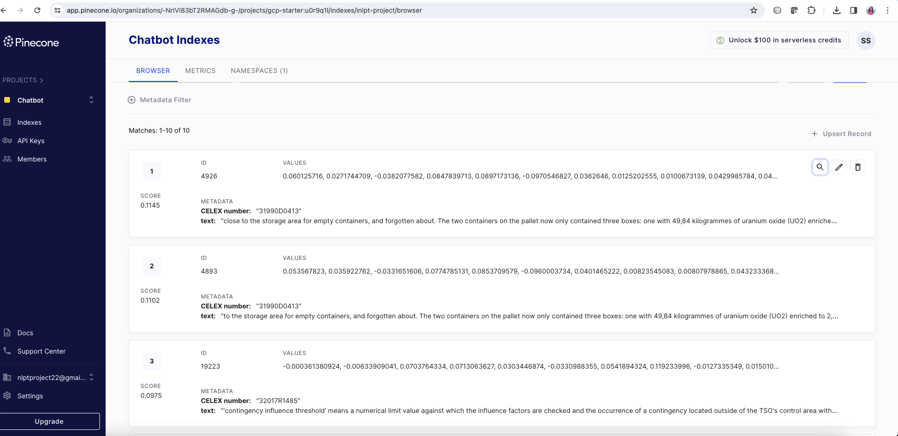

### Title: 
QA-Bot-INLPT-WS2023

### Our Team:
Sharma, Shivangi, M.Sc Data and Computer Science

Gudibandi, Shreeharsh Ashok, M.Sc Data and Computer Science

Chaturvedi, Suryansh, M.Sc Data and Computer Science

Schmid, Janik, M.Sc Data and Computer Science


### Member Contribution:
Who wrote what for this project report is marked at the start of each section of this report. An overview of each team member’s contribution is listed here:

- Sharma, Shivangi: Led the creation of the vector database, focusing on generating embeddings for HTML chunks of our data, also storing these embeddings within the selected vector database (ChunksEmbeddingsAndPineconeDB.ipynb)
Additionally, conducted an initial analysis of similarity algorithms, leveraging similarity scores to assess their effectiveness within our project and with the initial LLM pipeline. Moreover, at the very beginning of our project, explored the use of PDF file data instead of HTML, evaluating the quality of chunks obtained and contributing valuable insights into the early stages of our data processing work (notebooks under: ‘ExploredAndDiscardedAppraoches’ directory).Working on the final RAG system together with the whole team(QnA_system.ipynb)

- Gudibandi, Shreeharsh: Developed a systematic approach to generate questions using the lmqg model from given contexts. Evaluated rag_pipeline performance through question generation and answer comparison. Implemented code to feed generated questions into the rag_pipeline for answer retrieval. Designed evaluation metrics to assess the quality of generated answers, including BLEU, and ROUGE. Compared generated answers against reference answers to evaluate the effectiveness of our model.

- Chaturvedi, Suryansh: Contributed to setting up language model pipelines, including HuggingFace models and transformers for text generation and retrieval-based QA. Additionally, integrated Pinecone vector search for similarity queries. Assisted in configuring and optimizing model parameters for efficient text processing and retrieval.

- Schmid, Janik: The notebooks 'AnalyzeFromHtml.ipynb', 'Chunking.inpynb' and 'GetHtmlFileInfos.ipynb' as well as creating the search results 'Search results 20240102.csv' needed to get file information for each file. In addition, creating all Meeting reports. Working on the final RAG system together with the whole team.


### Anti-plagiarism Confirmation: 
We declare that what has been done in this project has been written by us 4 and that, with the exception of quotations, no part has been copied from scientific publications, the Internet or from research works already presented in the academic field by me or by other students.

In the case of parts taken from scientific publications, from the Internet or from other documents, we have expressly and directly indicated the source at the end of the quotation or at the foot of the page.

We also declare that we have taken note of the sanctions provided for in case of plagiarism by the current Study Regulations.


# Introduction
(by Shivangi Sharma)

Our project revolves around developing a sophisticated Question and Answering (QnA) system within the domain of Natural Language Processing (NLP) and Transformers. We aim to extract meaningful information from data present in HTML files, creating embeddings and indices for efficient storage in a vector database. Key to our approach is the implementation of a Language Model (LLM) pipeline using cosine matrix similarity, enabling the generation of contextually relevant answers to user queries.

### Overview:
Our journey involves data acquisition, embedding generation, vector database setup, and LLM pipeline development. As we progress, each section will delve into the intricacies of our approach, culminating in an evaluation of our QnA system's efficacy using a curated set of sample questions and answers.

### Expectations:
Readers can anticipate a concise exploration of our project's key phases, providing insights into the implementation and realization of our QnA system. The evaluation section will assess the system's effectiveness in delivering accurate and contextually relevant responses.

# Approach
(by Janik Schmid)

To do this task we implemented a RAG system. This system is using an already trained large language model that we just load. This way we do not have to bother training a LLM as this was out of scope with the resources we were having. The RAG system instead uses the collected data from the legal database in another way. We crawled that data, processed it into reasonable chunks and then added them to a vector database. Once a query is sent to our system the vector database is asked for the most similar entries to our query and that way we find information about our query. In the last step the LLM we are using is given the query and the information from the vector database in a large prompt, such that a answer is generated by the LLM that uses the given information as ground truth.

# Data Acquisition
(by Janik Schmid) *Related Code: 'AnalyzeFromHtml.ipynb' cells 2 und 3*

As we decided on the EUR-Lex data source for our project, the first step was to find a way to get access to the data. We were provided with a [link](https://eur-lex.europa.eu/search.html?name=browse-by%3Alegislation-in-force&type=named&displayProfile=allRelAllConsDocProfile&qid=1696858573178&CC_1_CODED=12) pointing to a search containing 549 different files at the time of our search. By creating an account we could request a CSV file containing the Celex number and other metadata for every file. Most important was the Celex number as this number is a unique identifier for the files that can be used to build a download url containing the respective file. The download files are put together like this:

```python
celex = celex.replace("(", "%28").replace(")", "%29")
url = 'https://eur-lex.europa.eu/legal-content/EN/TXT/HTML/?uri=CELEX:' + celex
```

This gives us a download url. Using the `requests` module we were now able to get the file text as the result of a GET request. We were also surrounding the requests with a retry loop to prevent unexpectedly failing requests from crashing the code.

As you may have noticed, the url they are using points towards the HTML file of the respective document. We also experimented with the PDF files that can be downloaded in a similar way. We finally decided on the HTML documents because HTML files are structured files with a tree structure we can exploit in our further file processing.

Another problem we were facing was detecting some files that do not exist in the english language. The problem here is that the GET request looks totally fine even in this case, but the HTML file returned is only there error page stating that the document does not exist. As a workaround we excluded these urls manually after finding all of them.

This left us with 537 English HTML files ready for further processing.

# File Processing
(by Janik Schmid) *Related Code: 'AnalyzeFromHtml.ipynb' cells 4 to the end and 'GetHtmlFileInfos.ipynb'*

The first thing we realized was that the files we are using all follow a certain structure. To be more precise we could figure that there are two distinct types of files. Here you can see screenshots of the two different files:


You can also access these by there links: [The left one](https://eur-lex.europa.eu/legal-content/EN/TXT/HTML/?uri=CELEX:21998A0912%2801%29) will be called a structured file while [the right one](https://eur-lex.europa.eu/legal-content/EN/TXT/HTML/?uri=CELEX:31998Y1217%2801%29) will be called unstructured in the following. 

There are 290 structured files and 247 unstructured files. But it's noteworthy that the structured files are bigger than the unstructured files on average. The 290 structured files contain more than 70% of the tokens in our corpus.

These naming conventions are motivated by the structure we could find and exploit in the different file types. As they are giving more opportunities and make up most of our corpus we concentrated on processing the structured files.

#### Unstructured Files

The unstructured files are mostly some additions or short declarations. They are not of a certain format. The lines are just inside `<p>` objects one after the other. That means we can't use the structure of the HTML file to get any further information about the file structure. We therefore just added each `<p>` we found as a new line to our 'lines.csv'.

#### Structured Files

The structured files provide far more options for us. To analyse them, we are using the `BeautifulSoup` class of the `bs4` python library. We use it to traverse through a HTML file with a recursive function that is essentially doing a DFS through the document. That means we explore each line in the order that it is displayed in the document and find different HTML objects on the way.

During analysis them we found the following noteworthy structural details:

- **Sections**: The files are split up into sections. The document always starts with a text section containing the major part of the document. We are calling it just the 'Document' section. After that come Additional sections, mostly 'ANNEX' sections. Each of them can have a footnote section directly below it. We can find these sections by searching for the `<hr>` objects that do have a class. The different classes that can be found are the following:
    - *'separator', 'oj-separator'*: They indicate that the 'Document' sections start. Only at most one of them is found in every document.
    - *'doc-sep', 'oj-doc-sep'*: They indicate that another section starts. We derive a name for the section by taking the start of the next line, because in almost all cases this line will be the heading for the new section.
    - *'note', 'oj-note'*: They indicate the start of a footnote section
    - *'doc-end', 'oj-doc-end'*: They indicate the end of the document

    Using these sections we have a first separation of the major parts of our codebase.

- **Articles**: The second structuring of the major level that all sections except footnotes use are articles. Such a section starts with a general part. Then there is a list of articles that are numbered and then the section ends. We find articles by searching for the header lines that start an article. We then extract the article number and keep it as additional information for all the following lines until the next article starts.

- **Enumerations and tables**: It may come unexpected that these two things have to be treated together, but during the HTML file analysis it got clear that we have to do this. The reason behind that is that a line in an enumeration is implemented in the HTML files as a 1x2 table with invisible borders. That means we can find enumerations in the text by looking for such tables. Whether it is a real table or an enumeration can again be found by looking at the class of the HTML object. If it has such a class it is a real table and if there is none, it is an enumeration.
    - *enumerations*: Just finding enumerations isn't enough if you want to handle them. You have to keep track which lines this enumeration all includes and how to treat nested enumerations. The way we came up with for this is using the counter 'enumerationTableCount' that goes up by one in our recursion if we enter the right part of the 1x2 table and saves the content of the left part (the number or letter like '(a)', '(4)' or '2.') into our memory. Only once we leave this table cell, again this memory will be cleared and the 'enumerationTableCount' will be decremented again. This way we can keep track of the nested enumeration that happens quite often in this HTML files.
    - *tables*: For the real tables we also came up with an idea to include their information into our corpus. For that we differentiate between two kinds of table: The ones with and the ones without a header line. This can be done by taking the first `<tr>` object in the table. This is the first row. If it has `<th>` objects inside it, these are header objects and the table has a header. There are also other tables with a header line which do not use these `<th>` objects. They mark the `<p>` objects inside as header by giving them the class 'tbl-hdr' or 'oj-tbl-hdr'.
    Having identified the table type we generated text for each row of the table. If it has a header we correlate them by "There is a correlation between: " and then heading entry pairs. If there is no header, we just generated a line with "There is a correlation between: " and then the entries of the row. This table is part of our corpus as language.

After all this processing we were left with a 'lines.csv' containing all the lines from the HTML files together with the mentioned structural information then found. It also contains the CELEX number of the files the line was part of.

## Chunking
(by Janik Schmid) *Related Code: 'Chunking.ipynb'*

In our first tests we were just using the lines form above as our documents for the text retrieval. Using this we soon realized that some lines are too short (sometimes only one token) and some too big. So it was clear that we need to do a chunking that respects the structure of the document we found and still uses the structural information.

For the unstructured case we just used the `RecursiveCharacterTextSplitter` from langchain to get overlapping chunks of the anticipated size.

For the structured files on the other hand we are using a for loop over all the lines we found in the file. Then we keep track of changing sections and new articles. Always then is the case, we spit our text there. For the rest we try to put our chunks together in a way that groups enumerations together and also splits at the end of an enumeration. At the end each split we got from the text is still processed by the `RecursiveCharacterTextSplitter` to get chunks of the anticipated size. The structural information about the lines in each chunk is also kept in another column.

This way we ended up with the 'chunks.csv' file that contains the documents we use for the text retrieval system.

# Data Integration
(by Shivangi Sharma)

This entire section we talk about the embeddings generation for our data chunks and vector database setup. In this, we go through the journey of exploration of several approaches to finalizing and implementing the best suited approach.

### Chunks Embedding

#### Pre-exploration Phase Before HTML Chunking
*Related Code: 'DataAcquisition/ExploredAndDiscardedAppraoches/SimilaritySearchCodeForPDF.ipynb'*

In the initial stage of our project, the exploration of PDF files for obtaining data chunks led me to experiment with embedding generation using the Spacy library. This endeavor aimed to leverage Spacy's open-source nature, user-friendly interface, and capacity to handle large amounts of data. However, the inherent vagueness of PDF files posed challenges in finding similar data, leading a shift in strategy towards HTML text-based chunks (already discussed in the Data Acquisition section).

#### Spacy Embedding Exploration:
*Related Code: 'DataIntegration/ExploredAndDiscardedAppraoches/SpacyEmbeddingsAndFaissDB.ipynb cells 1 to 6, SpacyEmbeddingsAndPineconeVectorDB.ipynb cells 6 to 9'*

Once we had our html text driven chunks, I read about different open source embedding models and decided to start with the open source ‘Spacy' library to generate embeddings using its "en_core_web_md" model for our data chunks. Spacy offered advantages such as being easy to implement and capable of efficiently processing a large number of text chunks.
The generated embeddings were then stored alongside their respective chunks in a Pandas dataframe, facilitating a visual representation of chunk occurrences. Later, this dataframe was later stored in the csv file ‘df.csv’ in our [project drive](https://drive.google.com/drive/folders/13Gcpoo0x-j_KYdEkCxGhqBbj-JavQ_hJ?usp=sharing) for further analysis and use.

#### Transition to Hugging Face Models:
*Related Code: 'DataIntegration/ChunksEmbeddingsAndPineconeDB.ipynb cells 1 to 3 and 7 to 9'*

However, as the project progressed, particularly during the development of our Language Model (LLM) pipeline (further discussed in detail in the LLM section), we faced some dimension variation issues between embeddings generated using Spacy and our query embeddings (generated using Hugging Face embedding models). 
In order to maintain consistency in dimensions and models throughout the project, finally we ended up using the Hugging Face 'sentence-transformers/all-MiniLM-L6-v2' embedding model for our html chunks.


### Vector Database

Building a good QnA chatbot involves carefully setting up the database, and in this section, I'll discuss my key contributions in exploring and choosing the best suited database solution.

#### Vector Database Research Journey:

I started by looking at different vector databases, and at first, using pgvector, as our database, seemed interesting. Due to its advantages like smoothly fitting with PostgreSQL, offering an open-source extension for efficient searches and flexibility for custom metadata storage made it seemed like a perfect choice. However, when explored later, I realized that it has a complicated integration process and added costs for handling separate metadata databases. Since we had a limited budget as students, we decided to choose a different option.

Following the decision to discard pgvector, I initially considered Pinecone as my second option. However, concerns arose about its closed-source nature and reliance on the paid OpenAI API for model compatibility. Driven by the need for an open-source solution, I turned my attention to Faiss.

#### Transition to Faiss:
*Related Code: 'DataIntegration/ExploredAndDiscardedAppraoches/SpacyEmbeddingsAndFaissDB.ipynb cells 7 to to the end'*

Faiss, an open-source vector database, presented itself as a promising solution that aligns with our financial constraints. Faiss offered a range of benefits, including its open-source nature, cost-effectiveness, and ease of setup. These attributes made it an attractive candidate for our vector database needs. I wrote pieces of code to generate Faiss-index for our embeddings and later stored them in our [project drive](https://drive.google.com/drive/folders/1VZ1XSHMXGLHbCai7mJ7mscSLM04935_k?usp=sharing) for future access. 

#### Development of Similarity Search Algorithm and Challenges with Faiss:
*Related Code: 'DataIntegration/ExploredAndDiscardedAppraoches/SimilaritySearch.ipynb'*

I developed a similarity score algorithm to work on our Faiss index and embeddings to get most similar chunks from our data. Coded the necessary components and even explored the possibility of integrating it into our Language Model (LLM) pipeline. However, despite the advantages of Faiss, certain limitations emerged in terms of storing our meta data in Faiss-index and its compatibility with the Langchain vectorstore model, our chosen framework for the LLM pipeline. This forced us to reconsider our approach and ultimately discard the Faiss-based solution for the LLM pipeline.

#### Reevaluation and Selection of Pinecone:
*Related Code: 'DataIntegration/ChunksEmbeddingsAndPineconeDB.ipynb cells 4 to 6 and 10 to the end'*

In the aftermath of Faiss discardation, I revisited Pinecone with a fresh perspective. Further reading and research revealed that Pinecone, contrary to initial concerns, can be used with the Hugging Face tokenizer—a crucial factor for our integration with the  Langchain and Lama 2 model. Moreover, Pinecone offers a free subscription tier that aligns with our budget constraints and boasts the capability to handle large numbers of tokens (up to 100K), ensuring scalability for our project. It also gives an option to use ‘cosine similarity matrix’, thus leveraging better similarity search criteria.
Finally, by using Pinecone I generated an index name ‘inlpt-project’ for storing our embeddings and related metadata. Credentials related to our database can be found in .env file under the DataIntegration folder.



Snapshot of our Pinecone Database 

#### Highlights of Vector Databases:
- PG Vector integrates seamlessly with PostgreSQL, but  requires a cloud platform to host it.
- Faiss is an efficient vector database but sometimes not compatible with major LLM models.
- Pinecone offers a convenient managed vector database with a focus on language models. Its free subscription can handle large amounts of data for projects like this one.

# Setting Up Language Model Pipelines
(by Suryansh Chaturvedi)

In this section, I orchestrated the configuration and seamless integration of Language Model Pipelines (LLMs) to fortify text generation and retrieval capabilities within our project framework.

### Exploration and Evaluation of Language Model Pipelines

#### Initial Model Evaluation
I meticulously conducted a thorough examination of various pre-trained language models, including GPT-3, MiniLM, BERT, and T5. This evaluation phase aimed to discern the most suitable models based on criteria such as performance, computational efficiency, and alignment with project objectives.

#### Integration with Hugging Face Models
Following comprehensive evaluation, we opted to integrate Hugging Face models into our pipeline. Specifically, we leveraged models like 'sentence-transformers/all-MiniLM-L6-v2' for embedding generation and 'meta-llama/Llama-2-13b-chat-hf' for text generation. This decision was driven by the versatility and robust performance offered by Hugging Face models.

### Integration of Retriever-Augmented Generation (RAG) Pipeline with Vector Store

#### Seamless Integration with Pinecone Vector Database
I spearheaded the integration of the Retriever-Augmented Generation (RAG) pipeline with our Pinecone vector database. By harnessing Pinecone's efficient vector storage and retrieval capabilities, we enhanced our system's question answering functionality. This integration facilitated the swift retrieval of relevant passages from our dataset based on user queries, significantly improving the accuracy and speed of our QA system.

### Interface Development and Functionalization
We developed an input button to take queries and also functionalized the rag_pipeline. 

### Highlights of LLM Integration:
- Exhaustive evaluation of pre-trained language models to identify optimal choices.
- Integration of versatile Hugging Face models for embedding and text generation.
- Rigorous testing across various scenarios to ensure reliability and efficiency.
- Seamless integration of RAG pipeline with Pinecone vector database, enhancing question answering functionality and system performance.

# UI and answer enhancement
(by Janik Schmid)

The user of our system executes the final notebook we provide and is left with an input field an a submit button at the end to talk to our system. The system is able to start a conversation with the user also giving reasonable responses to follow up questions. This is done by using a memory inside the RAG pipeline. 

The other thing that enhances the quality of our answer are the sources we display for our answer. For that we also return the documents found from the vector database as the result of our RAG pipeline. We then identify the used files and provide Title and document for the files used.

# Testing and Result Evaluation
(by Shreeharsh Ashok Gudibandi)
- Data: For the purpose of evaluating the rag_pipeline in the model, a dataset containing contexts(text containing the main paragraphs) was utilized. This dataset was loaded from a CSV file named "chunks.csv". Each entry in the dataset consists of a context in the form of main text used to generate hypothetical questions and reference answers.

### For the hypothetical question generation, the following methodology was implemented:

Baseline Approach: Utilized the lmqg library with the lmqg/t5-base-squad-qag model as our baseline approach for question generation. This baseline approach provided a reference point for comparing the performance of our proposed method.
Evaluation Metrics:
BLEU Score: Measures the n-gram overlap between generated questions and reference questions.
ROUGE Score: Evaluates the similarity between generated and reference questions based on n-gram overlap and recall.

Experimental Setup: Sampled a subset of text chunks from the dataset for generating hypothetical questions. Each text chunk served as a context for generating multiple questions using the baseline approach and our proposed method.


### Evaluation Method:
-Question Generation: Questions were generated from the contexts using the lmqg model. Each context was processed, and a set of questions was generated based on the content of the context, along with the reference answers from the context to be compared with the answers generated from the rag_pipeline of our model.

-Answer Retrieval: The generated questions were fed into the rag_pipeline for answer retrieval. The pipeline processed each question and returned the corresponding answer.

-Evaluation Metrics: 
BLEU Score: Measures the similarity between generated answers and reference answers.
ROUGE Score: Evaluates the quality of generated text summaries and responses.

Retrieved Answers: The rag_pipeline processed each generated question and returned the corresponding answer. The generated answers were compared with the reference answers as in the context. 
Evaluation Metrics:
BLEU Score: A good BLEU score across all generated answers, indicating a substantial overlap between the generated and reference answers.
ROUGE Score: ROUGE score across all generated answers, reflecting the overall quality and coherence of the generated responses.

### Results Experiments:
The utilization of the lmqg library for question generation and evaluating the retrieved answers yielded the following results:

Quantitative Evaluation:
The generated answers achieved competitive scores in terms of BLEU, and ROUGE  when compared to the reference questions' answers.
These metrics indicated the similarity and effectiveness of the generated output in capturing relevant information from the input contexts.

Integration with Retrieval Pipeline:
The generated questions were seamlessly integrated into the conversational retrieval chain (rag_pipeline), allowing for context retrieval and question answering based on the generated questions.

Evaluation of Generated Answers:
The generated questions were used to retrieve answers through the conversational retrieval chain, and the quality of the retrieved answers was evaluated using established metrics.
The evaluation metrics provided insights into the relevance and accuracy of the answers retrieved based on the generated questions.


# Conclusion and Future Work
(by Shivangi Sharma)

In conclusion, our QnA project, QA-Bot-INLPT-WS2023, has made significant strides in developing a decent Question and Answering (QnA) system within the domain of Natural Language Processing (NLP) with Transformers. Here are the key contributions and achievements of our project:

### Data Acquisition and Processing:
- Successfully acquired data from EUR-Lex, focusing on HTML files.
- Implemented a structured approach to processing HTML files, distinguishing between structured and unstructured documents.
- Developed a comprehensive chunking mechanism for creating meaningful text chunks suitable for further analysis.

### Embedding Generation and Vector Database Setup:
- Explored PDF files initially for chunking and embedding using Spacy but transitioned to HTML files due to the latter's structured nature.
- Utilized Spacy for initial embedding generation and storage in a Pandas dataframe for visualization.
- Explored and discarded PG Vector due to integration complexities and opted for Faiss, but later transitioned to Pinecone for its compatibility with Hugging Face models.
- Successfully integrated Pinecone as our vector database, storing embeddings and enabling efficient similarity search.

### Language Model Pipelines:
- Explored and evaluated various pre-trained language models, leading to the integration of versatile Hugging Face models for embedding and text generation.
- Seamlessly integrated the Retriever-Augmented Generation (RAG) pipeline with Pinecone vector database, enhancing the question-answering functionality.

### Testing and Result Evaluation:
- Conducted thorough evaluations using BLEU and ROUGE scores for question generation and answer retrieval.
- Achieved competitive scores, indicating the effectiveness of the generated questions and the relevance of retrieved answers.

## Limitations and Challenges:

- Initial exploration of PDF files for data acquisition posed challenges due to the vagueness of the content.
- Integration challenges with PG Vector and Faiss led to the exploration of alternative vector databases.
- Compatibility issues between Spacy embeddings and Hugging Face models necessitated a transition to Hugging Face embeddings.

## Future Work:

- **Enhanced Question Generation:** Further exploration of advanced question generation models to improve the diversity and quality of generated questions.
- **Advanced Embedding Techniques:** Experiment with advanced embedding techniques to enhance the representation of text chunks.
- **Continuous Evaluation:** Implement a continuous evaluation process to keep the system updated with the latest models and improve performance over time.
- **User Interface Improvement:** Enhance the user interface for better interaction and user experience.

In conclusion, our project has provided valuable insights into the complexities and challenges of developing an effective QnA system. The integration of various components, from data acquisition to embedding generation and vector database setup, has been a challenging yet rewarding journey. The achievements and lessons learned during this project lay a solid foundation for future enhancements and developments in the realm of Natural Language Processing and Question Answering systems.

# References

1. Spacy: Industrial-Strength Natural Language Processing (Official website) - https://spacy.io/

2. Faiss: A library for efficient similarity search (GitHub repository) - https://github.com/facebookresearch/faiss

3. Pinecone: Vector database for Similarity Search (Official website) - https://www.pinecone.io/

4. Le, Q. V., & Mikolov, T. (2014). Distributed representations of sentences and documents. In the International conference on machine learning (pp. 1188-1196).

5. Dwivedi et al. 2013, S.K. Dwivedi, V. Singh, Research and reviews in question answering system. Procedia Technology., 10 (2013), pp. 417-424, 10.1016/j.protcy.2013.12.378

6. Muttenthaler et al. Unsupervised Evaluation for Question Answering with Transformers, arXiv:2010.03222v1 [cs.CL] 7 Oct 2020

7. Ushio, Asahi, Fernando Alva-Manchego, and Jose Camacho-Collados. "An Empirical Comparison of LM-based Question and Answer Generation Methods." arXiv preprint arXiv:2305.17002 (2023).